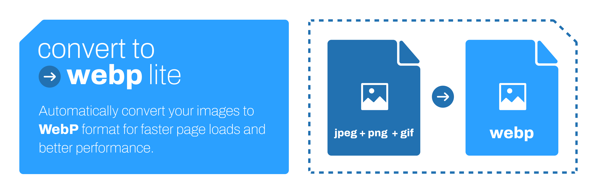
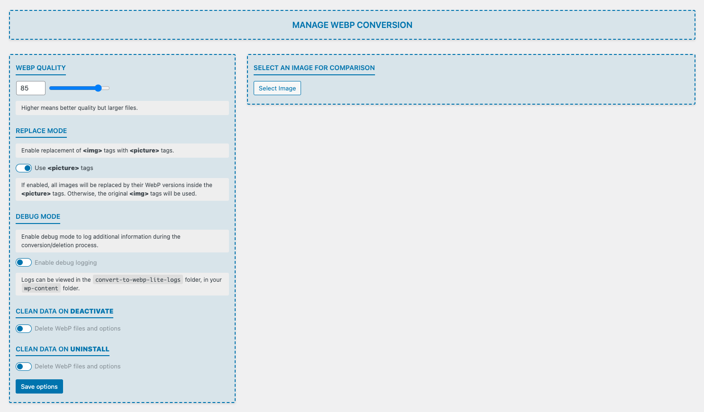
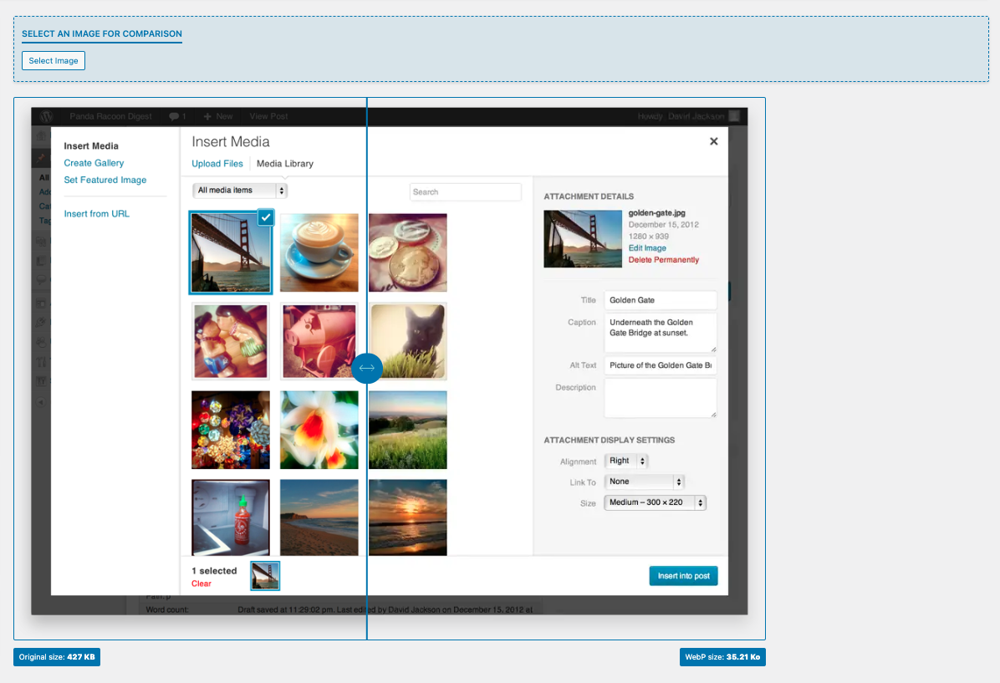
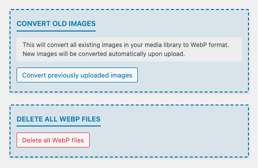

# Convert to WebP Lite



A simple and efficient WordPress plugin to convert your images to the WebP format for better performance and reduced bandwidth.

## Screenshots

### Plugin Interface

1. **Plugin Settings Page** - Configure WebP quality settings (0-100%), enable picture tag mode for automatic browser fallback, toggle debug mode for troubleshooting. The clean interface makes it easy to customize the plugin behavior to your needs.


1. **Image Quality Comparison** - Preview the difference between original and WebP images before bulk conversion. Side-by-side comparison helps you choose the optimal quality setting that balances file size reduction with visual quality for your specific needs.


1. **Bulk Operations Tool** - Convert your entire media library to WebP format with one click or safely delete all previously converted WebP images in a single operation.


## Features

- Automatically converts uploaded images from JPG, PNG or GIF to WebP format
- Supports bulk conversion of existing images in the media library
- Keeps original images as backup
- Seamless integration with WordPress media management
- Lightweight and easy to use

## Installation

1. Clone or download this repository to your `wp-content/plugins` directory.
2. Install the dependencies using Composer.
3. Activate the plugin from the WordPress admin dashboard.

## Development

This plugin uses Composer for dependency management and provides several useful scripts for development:

```bash
# Navigate to the plugin directory
cd wp-content/plugins/convert-to-webp-lite

# Install dependencies
composer install
```

This will install development dependencies including:

- **PHPUnit** - Unit testing framework (v9.6+)
- **Brain Monkey** - WordPress function mocking for tests
- **Mockery** - Advanced object mocking
- **Yoast PHPUnit Polyfills** - Cross-version PHPUnit compatibility
- **PHP CodeSniffer (PHPCS)** - Code quality and WordPress coding standards
- **Variable Analysis** - Additional code analysis

### Testing

The plugin includes a comprehensive test suite with **unit tests** and **integration tests** to ensure code quality and reliability.

The test suite uses:

- **PHPUnit 9.6+** for the testing framework
- **Brain Monkey** for mocking WordPress functions in unit tests
- **WordPress Test Suite** for integration tests with real WordPress environment
- **Mockery** for advanced object mocking
- **Xdebug** for code coverage analysis

All tests follow WordPress coding standards and use the Yoast PHPUnit Polyfills for cross-version compatibility.

```bash
# Run all tests (unit + integration)
composer run test

# Run only unit tests (262 tests)
composer run phpunit:unit

# Run only integration tests (40 tests)
composer run phpunit:integration

# Generate code coverage report (HTML format)
composer run phpunit:coverage

# Quick test run (unit tests without coverage)
composer run test:quick
```

The code coverage report is generated in `tests/coverage-html/index.html` and can be viewed in your browser.

**Test Structure:**

- `tests/unit/` - Unit tests for individual classes and methods
- `tests/integration/` - Integration tests for WordPress functionality
- `tests/TestCase.php` - Base test class with Brain Monkey setup for unit tests
- `tests/IntegrationTestCase.php` - Base test class extending WP_UnitTestCase for integration tests
- `tests/bootstrap.php` - Smart test environment initialization (auto-detects test type)

**WordPress Test Suite:**

Integration tests require the WordPress Test Suite. To install it:

```bash
# Run the installation script
bash tests/bin/install-wp-tests.sh wordpress_test root 'root' localhost latest
```

The installation script will download the WordPress test framework and create a test database.

### Code Quality

```bash
# Run PHP CodeSniffer to check coding standards
composer run phpcs

# Automatically fix coding standards issues
composer run phpcs:fix

# Generate a summary report
composer run phpcs:report
```

### Autoloading

The plugin uses PSR-4 autoloading for better code organization:

- Namespace: `ConvertToWebpLite\`
- Classes are located in the `includes/` directory

## Usage

- New images uploaded to the media library will be automatically converted to WebP.
- To convert existing images, go to the plugin settings page and use the bulk conversion tool.
- The original images are preserved for compatibility purpose

## Requirements

### End Users

- PHP 7.4 or higher
- WordPress 5.0 or higher
- The PHP GD or Imagick extension with WebP support enabled

### Contributors & Developers

- PHP 7.4 or higher
- [Composer](https://getcomposer.org/) for dependency management
- WordPress 5.0 or higher
- The PHP GD or Imagick extension with WebP support enabled
- [Xdebug](https://xdebug.org/) for code coverage (optional but recommended)
- MySQL or MariaDB for integration tests
- [Subversion (SVN)](https://subversion.apache.org/) for WordPress Test Suite installation

## License

This project is open source and available under the [GPL-3.0 License](./LICENSE.md).

---

Special thanks to [Romain Preston](https://github.com/romain-preston) for his help, code review and insightful comments

---

Developed by Pierre Hunout  
Email: [pierre.hunout@gmail.com](mailto:pierre.hunout@gmail.com)  
Support: [Buy me a coffee ☕](https://buymeacoffee.com/pierrehunout)
